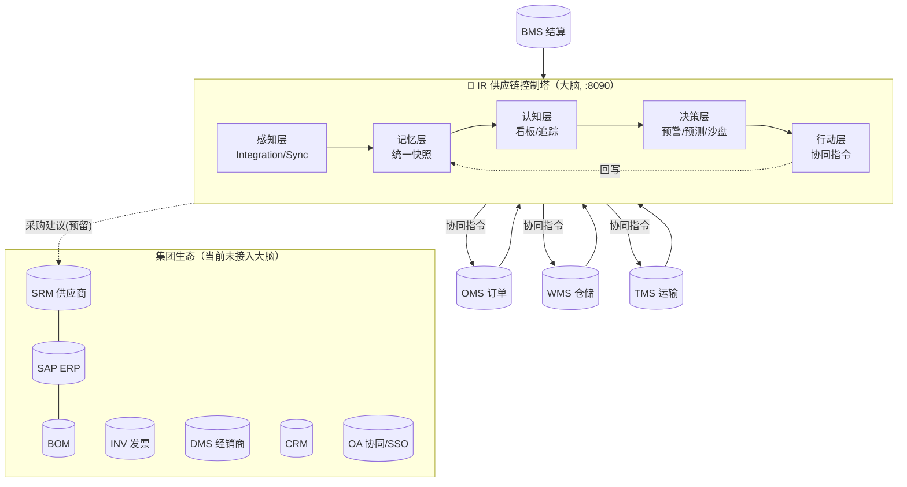
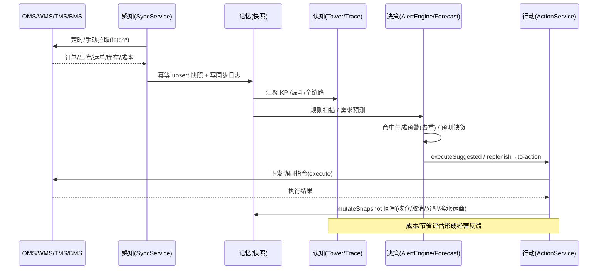

# 供应链大脑构造（IR 控制塔架构）

> 本文档描述当前供应链平台的“大脑”——IR 供应链控制塔的构造：它在整个 OTWB 供应链生态中的定位、内部分层、数据闭环、核心算法、集成契约与数据模型，并对已接入与待接入部分做出明确区分。内容以 `ir` 仓库当前代码为准（后端 `com.ir.*`，端口 `8090`；前端 `5174`）。

## 1. 一句话定位

IR 是位于 **OMS / WMS / TMS / BMS 之上的供应链控制塔（Control Tower）**。它自身不产生业务单据，而是通过“**感知 → 记忆 → 认知 → 决策 → 行动**”的闭环，把分散在各作业系统里的订单、仓储、运输、成本数据汇聚成统一视图，识别异常、预测需求、推演策略，并向下游系统下发跨系统协同指令，从而扮演供应链的“大脑”。

HTTP 仓配履约：`IR_HTTP_SYSTEMS=OMS,WMS,TMS` 时走 `GET /api/open/ir/snapshots` 与 `POST /api/open/ir/actions`。种子 `IR-SO-STUCK` → `OMS_HOLD`，`SO-IR-STUCK` → `WMS_ALLOCATE`，`WB-IR-DELAY` → `TMS_SYNC_TRACK`。

HTTP 采购补货：`IR_HTTP_SYSTEMS=SAP,OA,SRM` 时 `SAP_LOW_STOCK` 执行建议会按快照 `sku` 建 SAP PR，并协同 SRM 采购建议、OA 审批、WMS 补货；`OA_WF_PENDING` 执行 `OA_APPROVE_TASK`。BMS 成本走 `GET /api/open/cost/records`。

## 2. 平台全景：大脑与它的“躯干/器官”

整个集团存在多个独立部署的系统（各自独立仓库、独立库/端口）。按与供应链大脑的关系可分为三圈：

### 2.1 已接入大脑的执行系统（OTWB 核心链路）

| 系统 | 角色 | 主链路 | 对大脑的供给 |
| --- | --- | --- | --- |
| **OMS** 订单管理 | 订单中枢 | 多渠道下单 → 审核 → 分仓路由 → 库存预占 → 推 WMS → 发货/签收回传 → 售后 | 订单快照、渠道库存、日销量 |
| **WMS** 仓储管理 | 仓储作业 | ASN 收货 → 上架，出库单 → 分配 → 拣货 → 发运（波次/越库） | 出库单快照、库存汇总 |
| **TMS** 运输管理 | 运输执行 | 运输订单 → 调度运单 → 在途跟踪/电子围栏 → 三方物流 → 计费 | 运单快照、运费成本 |
| **BMS** 结算管理 | 计费结算 | 接收 WMS/TMS/OMS 单据 → AR/AP 自动计费 → 对账 → 发票 → 收付款 | 成本记录（约定 `/api/open/cost/records`，待上线） |

大脑与这四者的关系：**OMS→WMS→TMS→BMS** 是一笔订单从生成到履约再到结算的物理链路；IR 把这条链路“横切”出来，做全链路追踪与统一 KPI。

### 2.2 生态中的其它系统（当前尚未接入大脑，作为背景）

| 系统 | 定位 | 关键集成关系 |
| --- | --- | --- |
| **SRM** 供应商关系管理 | 对标 SAP Ariba：PR→RFQ→PO→SAP→ASN→WMS→GR→考核→发票三单匹配 | 与 WMS、SAP 集成；IR 中**预留为禁用**（`SRM`，enabled=false） |
| **SAP** ERP | MM/SD/FI/CO/PP 全流程 | 入站接 SRM（OData 风格），出站/回写接 BMS |
| **BOM** 零部件管理 | EBOM/MBOM/SBOM、ECR/ECN 工程变更 | 与 SAP 物料/BOM 同步 |
| **INV** 发票管理 | 进销项发票与税务合规 | 开放接口接 OMS/BMS/SRM |
| **DMS** 经销商管理 | 4S 店销售-售后-配件-满意度 | 作为 OMS 的一个渠道店铺做备件补货 |
| **CRM** 客户关系 | 线索/客户/商机/服务工单 | 通过 OA OAuth2 统一登录 |
| **OA** 协同办公 | 组织/人事/考勤/审批/薪资 | 提供 OAuth2.0（授权码+PKCE）统一认证，供 SAP/SRM/CRM 接入 |

> 说明：IR 当前只把 **OMS/WMS/TMS/BMS** 纳入“大脑”感知范围，`SRM` 已在系统表中预留但禁用；其余系统属于更大的集团生态，尚未接入控制塔。这与“当前供应链的大脑构造”这一命题保持一致。

### 2.3 全景关系图



## 3. 大脑的五层构造

IR 后端按“认知闭环”组织为五个功能层，对应 `com.ir.*` 下的包：

```mermaid
flowchart LR
    subgraph 感知["① 感知层 com.ir.integration"]
        CF[ClientFactory<br/>MOCK/HTTP 客户端]
        SYNC[SyncService<br/>@Scheduled 5min]
    end
    subgraph 记忆["② 记忆层 com.ir.snapshot"]
        SNAP[(统一快照表 ct_*_snapshot<br/>sales_daily / cost_record)]
    end
    subgraph 认知["③ 认知层 com.ir.tower / trace"]
        TOWER[TowerService 看板KPI]
        TRACE[TraceService 全链路追踪]
    end
    subgraph 决策["④ 决策层 com.ir.alert / forecast / sandbox / cost"]
        ALERT[AlertEngine 规则预警]
        FC[ForecastEngine 需求预测/补货]
        SB[SandboxEngine 策略沙盘]
        COST[CostService 成本分析]
    end
    subgraph 行动["⑤ 行动层 com.ir.action"]
        ACT[ActionService 跨系统指令]
    end
    感知 --> 记忆 --> 认知 --> 决策 --> 行动
    行动 -.mutateSnapshot 回写.-> 记忆
    ALERT -->|executeSuggested| ACT
    FC -->|to-action| ACT
```

### ① 感知层（Perception）— `com.ir.integration`

把外部系统的数据“看进来”。

- **客户端抽象**：`OmsClient / WmsClient / TmsClient / BmsClient` 四个接口，每个都提供 `fetch*`（拉数据）、`execute(ActionCommand)`（下指令）、`health()`（健康探测）。
- **双模式**：`ClientFactory` 根据 `ct_system.mode` 返回实现——`MOCK`（默认，内存确定性数据，见 `com.ir.integration.mock`）或 `HTTP`（`Http*Client`，走 `RestTemplate` 调真实系统）。
- **同步编排**：`SyncService`
  - `syncAll()` 遍历所有 `enabled=true` 的系统逐个 `sync(code)`；
  - 每个系统按类型拉取并落库：OMS→订单/库存/90 天日销量；WMS→出库单/库存汇总；TMS→运单/运费成本；BMS→90 天成本；
  - 每次写 `ct_sync_log`，并更新系统 `last_health_at / last_health_ok / last_error`；
  - `@Scheduled(cron = "${ir.sync.cron:0 0/5 * * * ?}")` 默认每 5 分钟自动同步一次。
- **接入配置**（`ct_system` 种子）：`OMS/WMS/TMS/BMS` 默认 `MOCK` 且启用，`SRM` 预留禁用。切换 HTTP 时对接各系统事实表端点（见 §7）。

### ② 记忆层（Memory）— `com.ir.snapshot`

大脑的“统一记忆”，把异构系统的数据规整为一套快照模型（幂等 upsert，自然键去重）：

| 快照表 | 来源 | 自然键 | 关键字段 |
| --- | --- | --- | --- |
| `ct_order_snapshot` | OMS | `order_no` | 渠道/店铺/仓库/省市/状态/金额/运费/各时间戳/wms_order_no/tms_order_no |
| `ct_wms_order_snapshot` | WMS | `code` | `external_no`(=OMS单)/状态/总量/已拣/已发/承运商 |
| `ct_shipment_snapshot` | TMS | `waybill_code` | `source_no`(=OMS单)/承运商/状态/计划到达/实际到达/运费/异常标记 |
| `ct_inventory_snapshot` | OMS/WMS | `(source_system, warehouse_code, sku)` | 在库/预占/可用/安全库存 |
| `ct_sales_daily` | OMS | `(date, sku, warehouse, channel)` | 日销量/金额（预测的输入） |
| `ct_cost_record` | TMS/BMS | 按 `source_system` 整体覆盖 | 业务日期/订单/仓库/承运商/成本类型/金额 |

三张单据快照通过 `order_no = external_no = source_no` 形成 **OMS↔WMS↔TMS 的关联主线**，是全链路追踪的基础。

### ③ 认知层（Cognition）— `com.ir.tower` / `com.ir.trace`

把记忆“看懂”，形成态势与链路视图。

- **控制塔看板 `TowerService.overview()`**：
  - KPI：今日订单、在途订单/待处理、在途运输、延误运单、低库存 SKU、未处理预警、近 30 天总成本、单均成本、**OTIF**（准时足额交付率）、平均履约时长；
  - 漏斗 `funnel`：OMS/WMS/TMS 各状态数量分布；
  - 成本趋势 `costTrend`（按天按成本类型）、仓库负载 `warehouseLoad`（WH-SH/BJ/GZ 待处理单量、库存量、低库存数）、TOP10 预警、系统健康。
- **全链路追踪 `TraceService`**：
  - 以订单为主键 join 出库单（`external_no`）与运单（`source_no`），给出阶段 `stage`（ORDER→WAREHOUSE→TRANSPORT→DELIVERED / CANCELLED）；
  - **卡单识别 `stuckHours`**：`AUDITED` 超 4h、`PICKING` 超 6h、运输计划到达已过未签收即判定卡单；
  - 详情页给出 `timeline`（OMS/WMS/TMS 节点）+ 订单成本 + 关联预警 + 关联动作，实现“一单到底”的可视化。

### ④ 决策层（Decision）— `alert` / `forecast` / `sandbox` / `cost`

把认知转化为判断与建议。

- **规则预警 `AlertEngine`**（详见 §5、§6）：按规则类型扫描快照，命中即生成预警，按 `(ruleCode, targetKey, OPEN)` 去重，带 `severity` 与 `suggestedAction`。
- **需求预测 `ForecastEngine` / `ForecastService`**（详见 §4.1）：MA / SES / Holt / Seasonal Naive / AUTO，输出预测点、置信带、MAPE 与补货建议。
- **策略沙盘 `SandboxEngine`**（详见 §4.2）：在不影响真实系统的前提下推演库存/需求/仓配策略，输出成本、服务水平、缺货、日序列，支持 baseline 与场景对比。
- **成本分析 `CostService`**：按类型/仓库/承运商/趋势汇总，单均成本、目标 vs 实际、以及由成功动作 `expectedSaving` 累计的预估节省（换商按运费×运价差，沙盘 apply 按条分摊）。

### ⑤ 行动层（Action）— `com.ir.action`

把决策“落下去”，形成闭环。

- **`ActionService.createAndExecute`**：根据动作类型前缀路由到目标系统（`OMS_/WMS_/TMS_` → 对应系统；`SAP_/BOM_/INV_/CRM_/DMS_/OA_` → 对应系统；其余 → `SRM`），构造 `ActionCommand` 调用对应客户端 `execute`，执行成功后 `mutateSnapshot` 同步回写本地快照（如改仓、挂起、取消、分配、换承运商），状态 `PENDING→RUNNING→SUCCESS/FAILED`。待办执行用条件更新抢占，避免并发双执行；复用待办时刷新 `expectedSaving`。
- **闭环入口**：预警 `executeSuggested(alertId)` 与预测 `replenish/to-action` 均汇聚到 `ActionService`，把“发现问题/预测缺货 → 建议动作 → 跨系统执行 → 回写”串成一条自动化链路。补货建议的 `inTransit` 取自 SRM/SAP 未关闭 PO/ASN。

### 支撑层 — `com.ir.system` / `com.ir.common`

登录鉴权（Bearer Token、`AuthInterceptor`、角色 `ADMIN/PLANNER/VIEWER`）、操作日志（`OperationLogInterceptor`）、统一响应 `R{code,msg,data}`、编号生成 `CodeGenerator`、全局异常处理等。

工程上每个功能包再按阿里手册 / OMS 同构拆 `controller` / `service` / `engine` / `entity` / `mapper`，避免 Controller、Service、实体平铺在同一目录。启动热身在 `system.service.BootstrapService`，`IrApplication` 只负责启动与 `@MapperScan("com.ir.**.mapper")`。

## 4. 核心算法

### 4.1 需求预测与补货（`ForecastEngine` / `ForecastService`）

- **历史输入**：`ct_sales_daily` 近 90 天，按 SKU（可指定仓库）按日聚合。
- **算法族**：
  - `MA` 7 日移动平均；
  - `SES` 指数平滑（α=0.3）；
  - `Holt` 双参数（α=0.3, β=0.1，含趋势）；
  - `Seasonal Naive` 周季节（周期 7，取最近 4 个“同星期”均值）；
  - `AUTO` 对上述四种做回测，选 **MAPE** 最小者。
- **回测 MAPE**：留出末段 `holdout = min(14, size/3)`，逐点单步预测比实际，取平均绝对百分比误差。
- **置信带**：以近 14 天残差标准差 σ，区间为 `预测值 ± 1.28σ`（约 80% 置信）。
- **补货建议 `replenish`**：对每个库存项跑 AUTO 预测，`日均 = 预测总量/horizon`，`安全库存 = 日均 × serviceDays`，`在途 = 同 SKU 未关闭 SRM/SAP PO 与 ASN 的较大值`，`建议补货 = 预测总量 + 安全库存 − 可用 − 在途`，并推算 `stockoutDate`。可转 `SRM_PURCHASE_SUGGEST` 或 `WMS_REPLENISH`。

### 4.2 策略沙盘（`SandboxEngine`）

- **分仓策略**：`NEAREST`（最近）、`LOWEST_COST`（最低成本）、`BALANCED`（均衡库存/需求）、`SINGLE_WAREHOUSE`（单仓）。
- **仿真要素**：三仓（WH-SH/BJ/GZ）× 区域距离矩阵、`seasonalNaive` 需求 × 渠道/需求乘子、按 `safetyDays` 触发补货并按 `replenishLeadDays` 到货。
- **成本构成**：`FREIGHT / HANDLING / PACKAGING / STORAGE / STOCKOUT_PENALTY`（承运商组合按运价加权）。
- **输出**：总成本、按类型/仓库/承运商成本、服务水平、缺货量、平均时效、日序列、SKU 汇总；`baseline` 场景可与其它场景做 `compare` 对比。

## 5. 内置预警规则（`ct_rule` 种子）

| 规则码 | 类型 | 触发条件（params） | 级别 | 建议动作 |
| --- | --- | --- | --- | --- |
| `OMS_STUCK` | ORDER_STUCK | `AUDITED` 超 4h | HIGH | `OMS_HOLD` |
| `WMS_STUCK` | WMS_STUCK | `PICKING` 超 6h | HIGH | `WMS_ALLOCATE` |
| `TMS_DELAY` | TMS_DELAY | 计划到达已过未签收 | HIGH | `TMS_SYNC_TRACK` |
| `LOW_STOCK` | LOW_STOCK | 可用 < 安全库存 | MEDIUM | `SRM_PURCHASE_SUGGEST` |
| `COST_OVERRUN` | COST_OVERRUN | 近 7 天单均成本 > 阈值 | MEDIUM | `TMS_SWITCH_CARRIER` |
| `FORECAST_STOCKOUT` | FORECAST_STOCKOUT | 预计 horizon(14) 内缺货 | MEDIUM | `SRM_PURCHASE_SUGGEST` |
| `UNSHIPPED_ORDER` | ORDER_STUCK | `PAID` 超 24h 未发货 | LOW | `OMS_PRIORITIZE` |
| `EXCEPTION_SHIPMENT` | TMS_DELAY | 运输异常标记 | HIGH | `TMS_SYNC_TRACK` |

预警状态：`OPEN → ACK / IGNORED / RESOLVED`。规则可在“规则”页增删改与启停。

## 6. 跨系统协同动作（`ActionService.types`）

| 目标系统 | 动作类型 | 说明 |
| --- | --- | --- |
| OMS | `OMS_REROUTE_WAREHOUSE` / `OMS_HOLD` / `OMS_UNHOLD` / `OMS_PRIORITIZE` / `OMS_AUTO_PROCESS` / `OMS_CANCEL` | 改仓、挂起/恢复、提优先级、一键处理、取消 |
| WMS | `WMS_ALLOCATE` / `WMS_REPLENISH` | 触发分配、补货 |
| TMS | `TMS_DISPATCH` / `TMS_SYNC_TRACK` / `TMS_SWITCH_CARRIER` | 调度、同步轨迹、切换承运商 |
| SRM | `SRM_PURCHASE_SUGGEST` / `SRM_SUBMIT_PR` / `SRM_APPROVE_PR` | 采购建议、提交/审批采购申请 |
| SAP | `SAP_CREATE_PR` / `SAP_RELEASE_PR` / `SAP_RELEASE_MO` | 创建/释放采购申请、释放生产订单 |
| BOM / INV / CRM / DMS / OA | 见 `ActionService.types` | BOM 展开、开票、商机/工单、经销商补货、审批 |

## 7. 集成契约（切换 HTTP 时的下游端点）

| 系统 | 认证 | 读取端点（示例） |
| --- | --- | --- |
| OMS | Bearer | `/api/order/page`、`/api/inventory/page`、`/api/dashboard`、`/api/report/order-daily` |
| WMS | Bearer | `/api/outbound/order/page`、`/api/inventory/summary`、`/api/dashboard`、`/api/report/kpi` |
| TMS | 无 | `/api/waybill/page`、`/api/billing/page`、`/api/dashboard` |
| BMS | API Key | 约定 `GET /api/open/cost/records?from&to`（**尚未上线**） |

> 端口约定：IR 后端 `8090`、前端 `5174`（`/api` 代理到 `8090`）。`ct_system` 种子中的下游 base_url 为占位，实测请以各系统真实端口为准。

## 8. 数据模型（`ct_*` 表）

- 集成：`ct_system`、`ct_sync_log`
- 快照：`ct_order_snapshot`、`ct_wms_order_snapshot`、`ct_shipment_snapshot`、`ct_inventory_snapshot`、`ct_sales_daily`、`ct_cost_record`
- 决策：`ct_rule`、`ct_alert`、`ct_action`、`ct_forecast`、`ct_scenario`、`ct_cost_target`
- 系统：`ct_user`、`ct_op_log`

## 9. API 面板（`/api` 前缀）

`/tower`（看板）、`/trace`（追踪）、`/alert` + `/rule`（预警与规则）、`/action`（协同指令）、`/forecast`（预测/补货）、`/sandbox`（沙盘/场景/对比）、`/cost`（成本/目标/节省）、`/integration`（系统接入/同步/健康/日志）、`/auth` + `/system`（登录/用户/操作日志）。

## 10. 端到端闭环（大脑如何“思考并行动”）



## 11. 当前状态与演进方向

**已具备（当前构造）**
- 12 系统 MOCK/HTTP 感知与统一快照、看板与全链路追踪、预警、跨系统协同动作、需求预测与补货（含 SRM/SAP 在途）、人工/自动沙盘、成本与节省分析、闭环回写。

**待完善（后续演进）**
- **打通真实 HTTP 接入**：将 `ct_system.mode` 从 MOCK 切到 HTTP，联调各系统真实端点。
- **事件驱动替代轮询**：由当前 5 分钟定时同步演进为消息/事件推送，降低时延。
- **更丰富的规则与算法**：引入更多异常规则与机器学习预测，提升 AUTO 选优与置信区间质量。
- **成本节约口径**：`expectedSaving` 仍是建议额，尚未与 BMS 实际账单对账。

---

*本文基于 `ir` 仓库当前代码整理，用于说明供应链“大脑”的整体构造与运行机制；实现细节以源码为准。*
