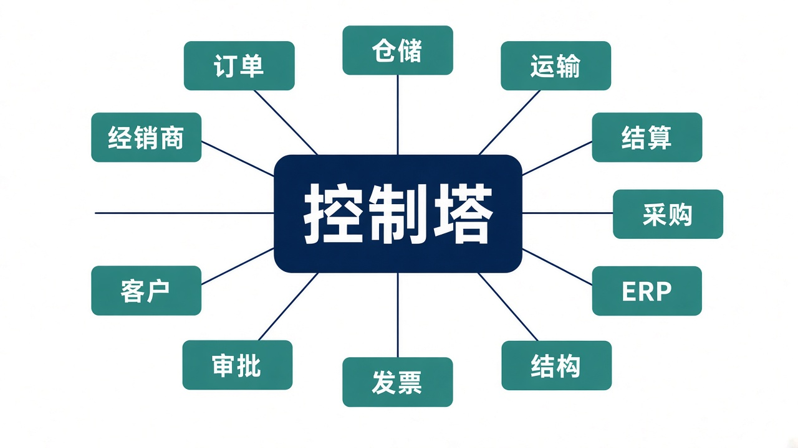
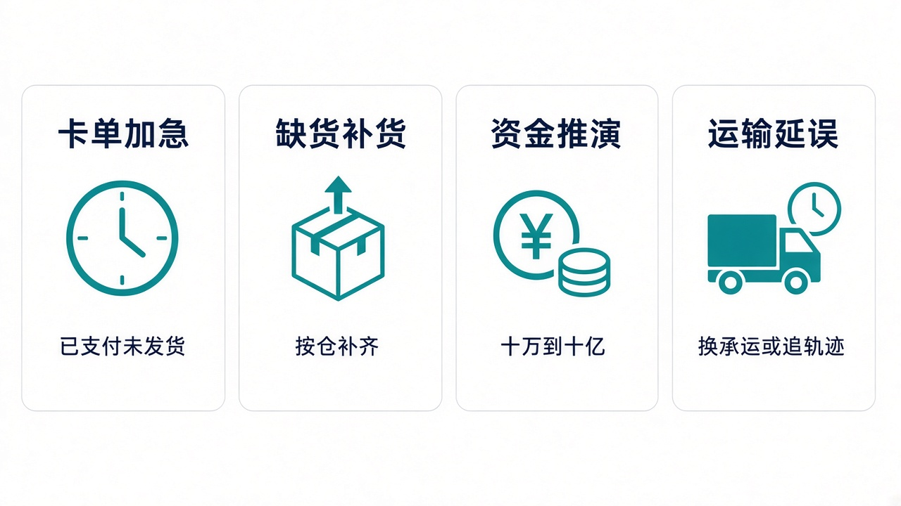
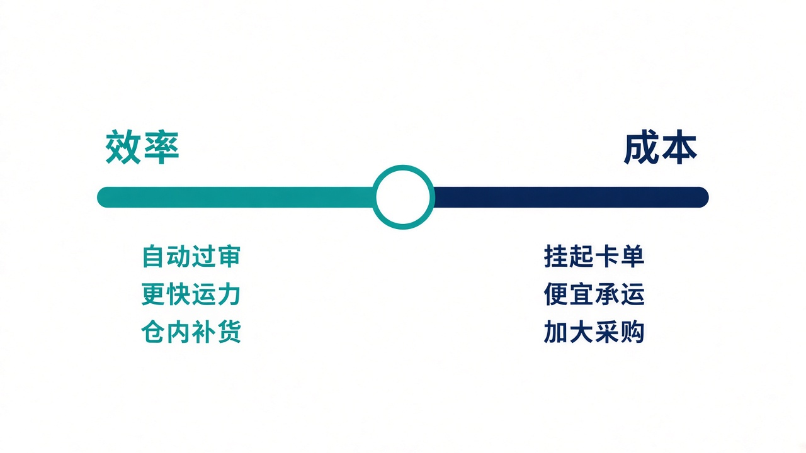
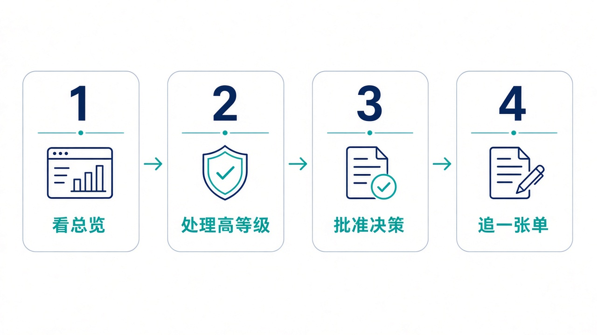

# 给大家讲：这套控制塔怎么用

这篇给还没进过系统的同事。先看它管什么、适合什么场合、亮点在哪，再按一天的用法走一遍。页面上的每个按钮，见 [业务使用手册](./业务使用手册.md)。

## 它是什么

控制塔自己不接单、不拣货、不算账。订单在 OMS，库存作业在 WMS，运单在 TMS，钱在 BMS。采购、ERP、产品结构、发票、审批、客户、经销商各自记账。

控制塔站在这些系统上面，做三件事：把单据拉成一张快照，判断哪件事该先做，再把指令打回去。

所以不要在控制塔里新建一张销售订单，也不要在这里改结算费率。要改的是跨系统的动作：挂起、加急、改仓、分配、补货、调度、换承运商、采购建议、催单、释放生产订单、审批、开票推进、商机前进一步、经销商补货。

## 适合什么场景

| 场景 | 大家现在的痛 | 在控制塔里怎么做 |
| --- | --- | --- |
| 已支付但迟迟不发货 | 要分别打开订单、仓库、运输才能知道卡在哪 | 订单追踪按「卡滞」筛出来。已创建或已审核可以挂起；已经支付的用加急，不要挂起 |
| 某个仓缺货，别的仓或供应商还有量 | 补货建议和采购申请散在两个系统 | 补货建议转成仓内补货或采购建议。源仓和目标仓不同时，走跨仓调拨 |
| 资金只有这些，需求如果翻倍还扛不扛得住 | 靠表格估，口径每次都不一样 | 人工沙盘选 10 万、百万、千万、亿、十亿，或填一个自定义金额，看可靠、偏紧还是不足 |
| 运费高，或者车已经晚点 | 换承运商和追轨迹要进运输系统一单一单点 | 总览的下一步动作里执行「更换承运商」或「同步轨迹」 |
| 早会要决定今天偏省钱还是偏准时 | 两个目标在两张报表里，动作对不上 | 总览上把立场滑到成本或效率，保存后重评预警 |

不适合拿来做的事：代替财务入账、代替仓库盘点、在没有 API Key 时发起审批或改工程变更。结算系统只给控制塔读成本。

## 亮点

1. **一屏就能动手。** 总览同时放目标达成、资金结论、待审批和下一步动作。点执行就打到对应系统，一次最多 8 条。
2. **成本和效率可以当场换。** 见下图。保存后，和立场冲突的待办会被作废，不会两套建议叠在一起。
3. **两套沙盘。** 人工沙盘用来改需求和资金，看完再决定只生成待办，还是立即执行。系统自动沙盘按综合分给一个推荐，默认不下发。
4. **资金按量级推，不是只看一张演示账。** 可以从 10 万扫到十亿，看哪一档开始吃紧。
5. **自动平衡有护栏。** 可以关掉，可以只给建议，也可以只自动执行低风险决策。服务水平掉下去之后，不再自动做降本。
6. **一张订单看完整条链。** 追踪把订单、出库、运单、这单成本、预警和已经下过的指令放在一起。
7. **同一条指令连点不会连发。** 对方已经执行过，就返回第一次的结果。超时没看清结果时，状态是待对账，先去执行系统核对，不要马上再发。
8. **页面上的节约不是已经入账的利润。** 它是指令上的预计节约。运单如果已经进了结算，汇总优先用结算数。

滑块靠左，控制塔更倾向自动过审、追更快的运力、在仓内补货。滑块靠右，更倾向挂起卡单、换便宜承运商、加大采购批量。改完要点「保存并重评预警」。

## 一天怎么用

1. **看总览。** 先看目标达成分和未达标个数，再看资金是可靠、偏紧还是不足。资金不足时，先不要采用会加大采购的沙盘方案。
2. **处理高等级。** 在「下一步动作」里单条执行，或点「执行高等级」。只读用户看不到执行按钮，把事项交给计划员。
3. **批准决策。** 有待审批时，打开「自动平衡」，看运行前和运行后，再批准或拒绝。拒绝不会去执行系统改单。
4. **追一张单。** 别人问「这单到哪了」，用订单号进「订单追踪」。要解释资金或需求翻倍，再开人工沙盘，不要在追踪页里改仓。

管理员、计划员可以写。只读用户可以看全部页面。用户管理和操作日志只有管理员能进。

演示环境默认是模拟数据，点成功只说明控制塔自己的闭环通了。要打到真实系统，管理员在「系统集成」里把对应系统改成在线。快照大约每 5 分钟拉一次，源系统刚改完的单，这里最多晚一个周期才看见。

## 接着看哪里

| 想了解 | 文档 |
| --- | --- |
| 每个页面怎么点 | [业务使用手册](./业务使用手册.md) |
| 系统怎么分层、指令打到哪 | [供应链大脑构造](./供应链大脑构造.md) |
