# IR 供应链控制塔 · 项目汇报

> 汇报口径：截至 2026-09（默认分支 `devin/1788774439-control-tower`）。
> 配套材料：[业务使用手册](./业务使用手册.md) · [架构说明](./供应链大脑架构.md) · [项目亮点](./项目亮点.md) · [图文导读](./图文导读.md)

---

## 1. 一页总览

| 维度 | 结论 |
| --- | --- |
| 项目定位 | 位于 OMS / WMS / TMS / BMS 之上的 **供应链控制塔**：不接单、不拣货、不算账，只做"看全局 → 发现问题 → 推演方案 → 下指令" |
| 建设周期 | 2026-09-07 立项 → 当前，累计 102 次提交、72 个 PR，全部经过自动化 Review 与 CI |
| 接入范围 | 核心链路 4 套（OMS/WMS/TMS/BMS）+ 生态 8 套（SRM/SAP/BOM/INV/DMS/CRM/OA 等），MOCK / HTTP 双模式可切换 |
| 交付规模 | 后端 Java 约 1.7 万行、前端约 6 千行；24 张业务表、82 个 REST 接口、19 个业务页面 |
| 质量基线 | 后端 173 个自动化测试全绿、前端 ESLint/Prettier/Vitest、全路由 UI 巡检、API 冒烟脚本、浏览器端到端录屏测试 |
| 交付形态 | 可移植 JAR、Windows/macOS(Intel & Apple Silicon)/Linux 原生安装包、Docker 镜像 |

---

## 2. 为什么要做控制塔

OTWB 四套系统已经把"接单 → 出库 → 运输 → 结算"跑通了，但它们各自记账、各看各的屏，带来三个痛点：

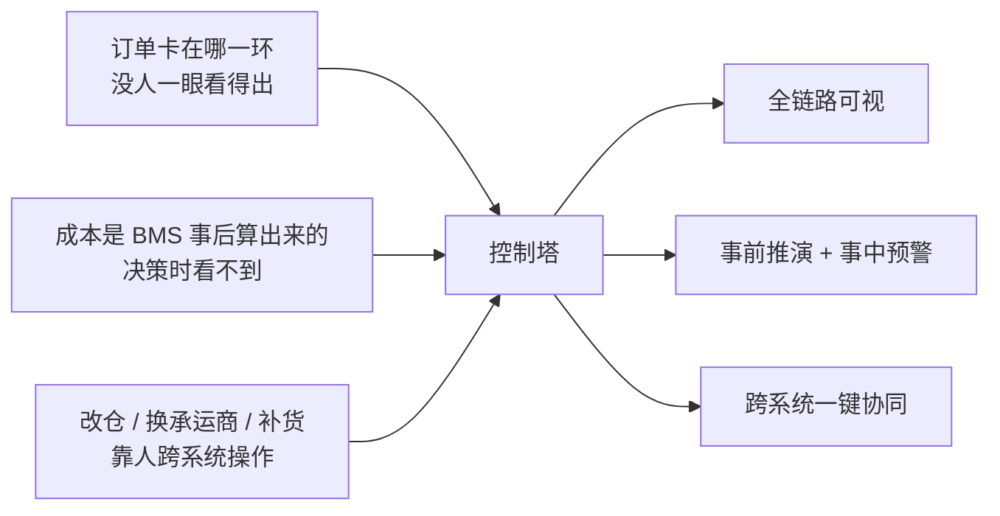
```mermaid
flowchart LR
    A[订单卡在哪一环<br/>没人一眼看得出] --> D[控制塔]
    B[成本是 BMS 事后算出来的<br/>决策时看不到] --> D
    C[改仓 / 换承运商 / 补货<br/>靠人跨系统操作] --> D
    D --> E[全链路可视]
    D --> F[事前推演 + 事中预警]
    D --> G[跨系统一键协同]
```

目标是把"降低 BMS 核算出来的成本"变成一个可以在 **下单前推演、执行中干预、事后复盘** 的闭环。

---

## 3. 系统全景

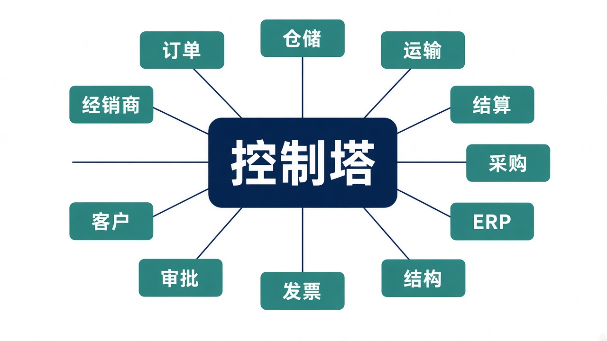

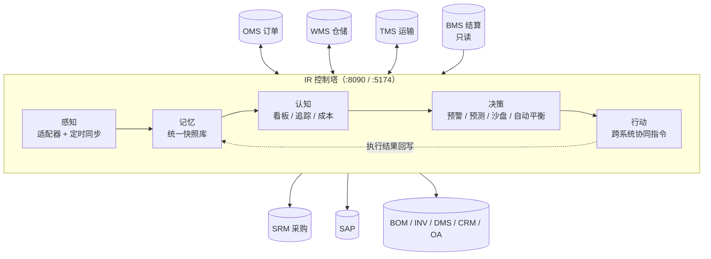
```mermaid
flowchart TB
    subgraph IR["IR 控制塔（:8090 / :5174）"]
        direction LR
        P[感知<br/>适配器 + 定时同步] --> M[记忆<br/>统一快照库] --> C[认知<br/>看板 / 追踪 / 成本] --> D[决策<br/>预警 / 预测 / 沙盘 / 自动平衡] --> A[行动<br/>跨系统协同指令]
        A -.执行结果回写.-> M
    end
    OMS[(OMS 订单)] <--> IR
    WMS[(WMS 仓储)] <--> IR
    TMS[(TMS 运输)] <--> IR
    BMS[(BMS 结算<br/>只读)] --> IR
    IR --> SRM[(SRM 采购)]
    IR --> SAP[(SAP)]
    IR --> ECO[(BOM / INV / DMS / CRM / OA)]
```

- **只读 BMS**：控制塔只取成本，不改账，节约值与实账分开展示。
- **MOCK / HTTP 双模式**：每套系统可单独切换，无凭据时走登录模式回退，便于分阶段接入。
- **安全边界**：出站地址校验（禁止内网/链路本地/云元数据地址）、DNS 固定、禁用重定向、指令幂等键防重发。

---

## 4. 核心能力与成果

### 4.1 控制塔总览 —— 一屏指挥

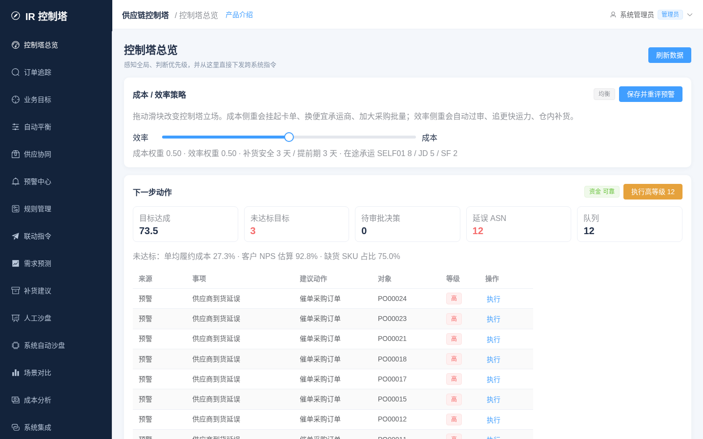

- 30 日订单量 / 履约漏斗 / 30 日总成本与单均成本（与成本页同一口径）。
- **可下发的指令队列**：目标偏差、待审批、下一步动作集中在一屏，点执行即打到对应系统（一次最多 8 条）。
- 成本 / 效率立场滑块：保存后自动重评预警，并作废与新立场冲突的待办。

### 4.2 全链路追踪 —— 一张订单看完整条链

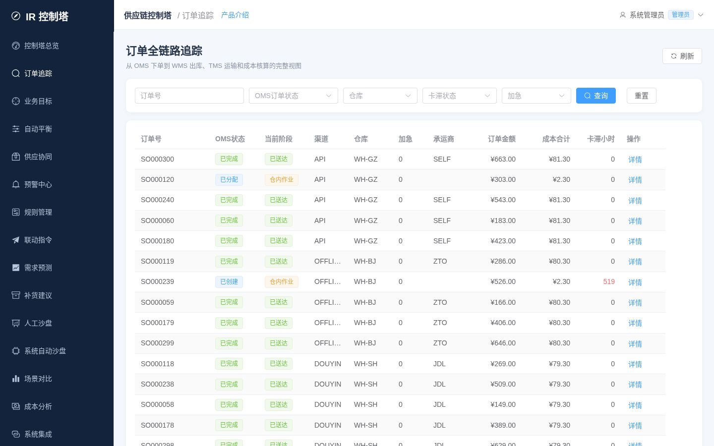

按订单号把 OMS 订单、WMS 出库单、TMS 运单、BMS 成本、相关预警与已下发指令拼成一条时间线，卡单直接定位到环节。

### 4.3 预警与协同指令 —— 发现即处置

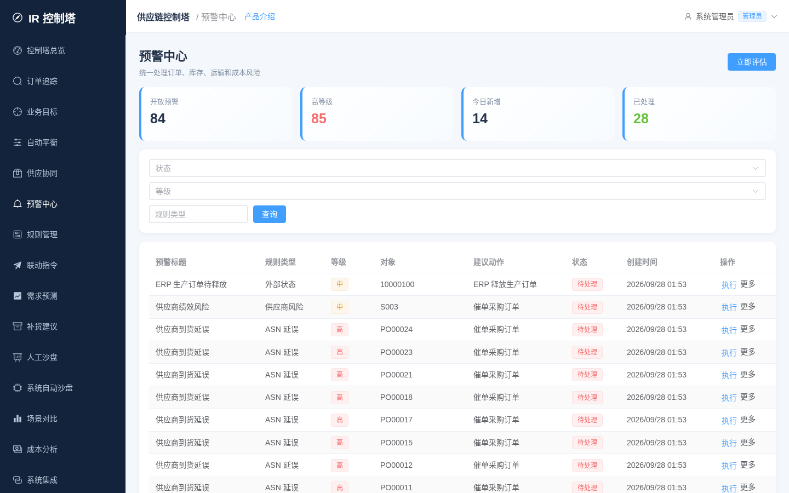

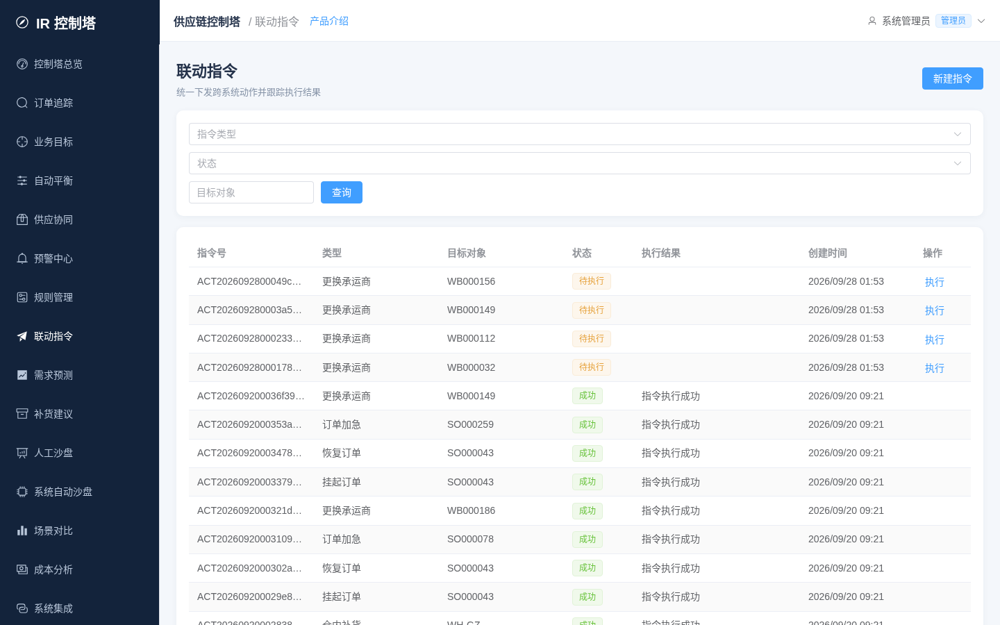

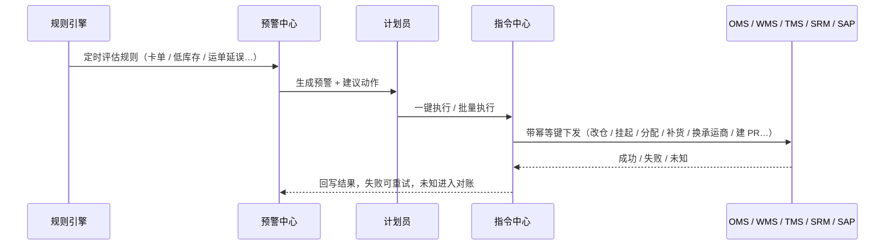
```mermaid
sequenceDiagram
    participant R as 规则引擎
    participant A as 预警中心
    participant U as 计划员
    participant X as 指令中心
    participant S as OMS / WMS / TMS / SRM / SAP
    R->>A: 定时评估规则（卡单 / 低库存 / 运单延误…）
    A->>U: 生成预警 + 建议动作
    U->>X: 一键执行 / 批量执行
    X->>S: 带幂等键下发（改仓 / 挂起 / 分配 / 补货 / 换承运商 / 建 PR…）
    S-->>X: 成功 / 失败 / 未知
    X-->>A: 回写结果，失败可重试，未知进入对账
```

- 规则可配置，覆盖订单卡滞、库存低于安全线、运单超时、SAP 低库存、OA 待办等场景。
- 指令跨 12 套系统，重复点击不会连发；结果 UNKNOWN 时进入待对账而非误判成功。

### 4.4 销量预测与补货 —— 从经验到模型

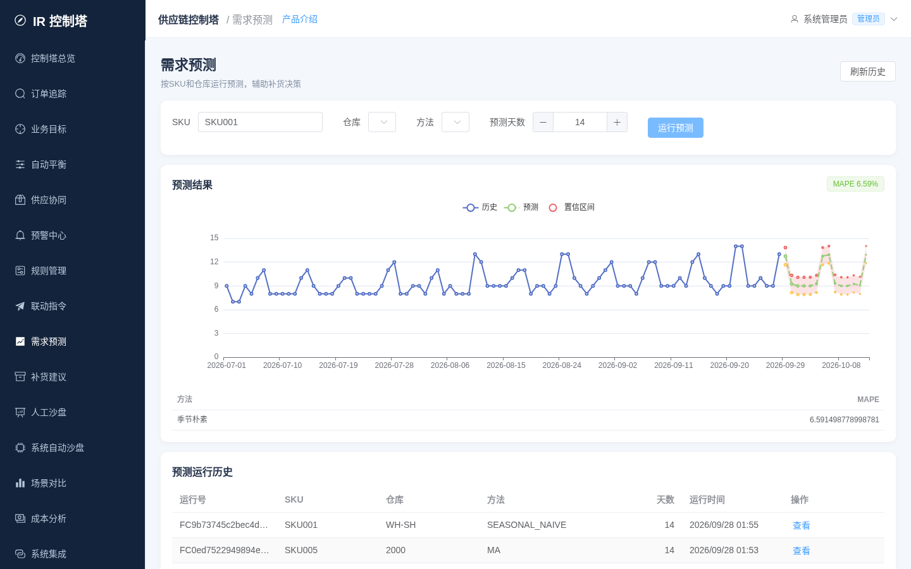

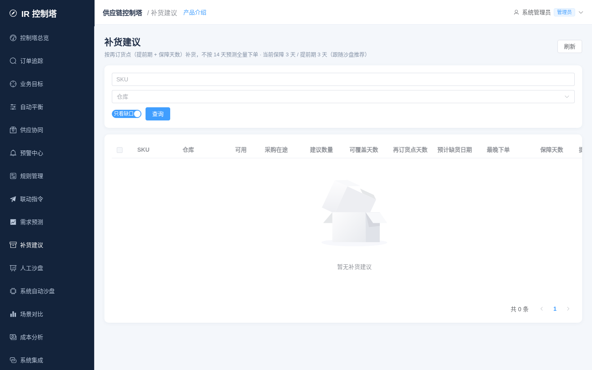

- 四种模型（移动平均 / 指数平滑 / Holt / 季节朴素）+ 自动选优，按 SKU × 仓输出 14 日预测。
- 补货建议叠加在途采购（含多行采购单逐行归属）、安全库存天数，可一键批量生成 WMS 补货 / SRM 采购建议 / SAP PR。

### 4.5 沙盘推演 —— 先算再干

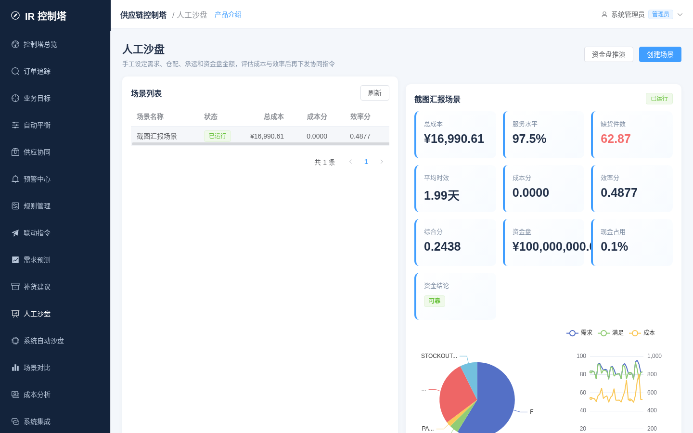

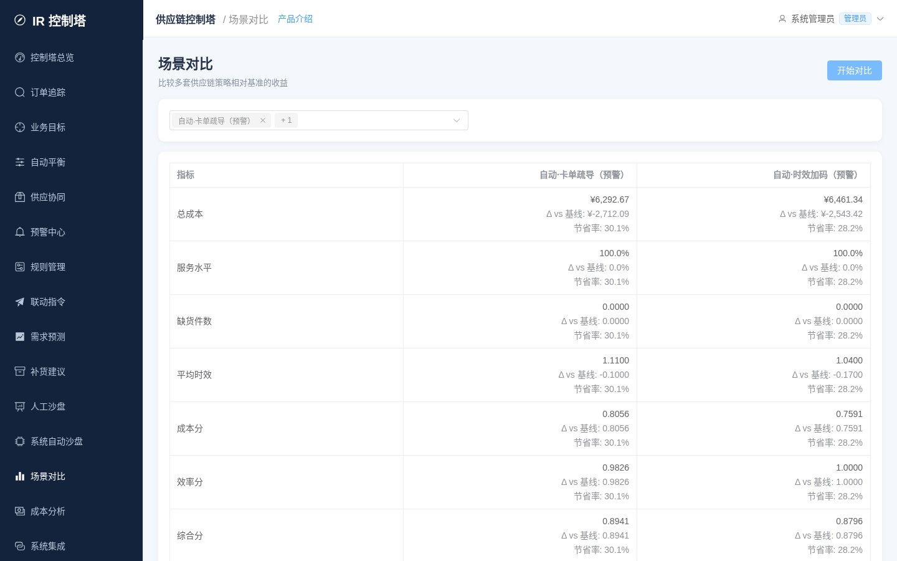

- 可调参数：需求倍数、渠道结构、分仓策略、承运商组合与费率、安全库存、仓储 / 作业 / 包材 / 缺货成本、补货周期、初始库存。
- 输出总成本、服务水平、成本分 / 效率分 / 综合分，多场景横向对比并可一键转为指令。
- **资金盘**：按 10 万 / 百万 / 千万 / 亿 / 十亿量级一次跑完，支撑 10 万级 SKU。
- **系统自动沙盘**：定时按综合分给推荐，默认只生成待办，不越权执行。

### 4.6 目标、自动平衡与供应协同 —— 有护栏的自动化

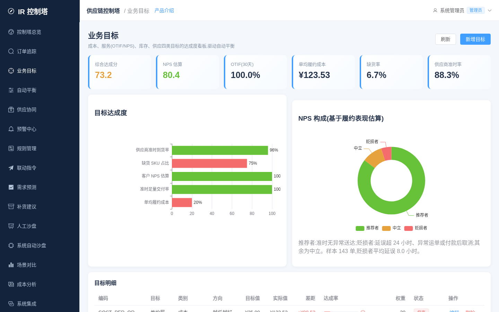

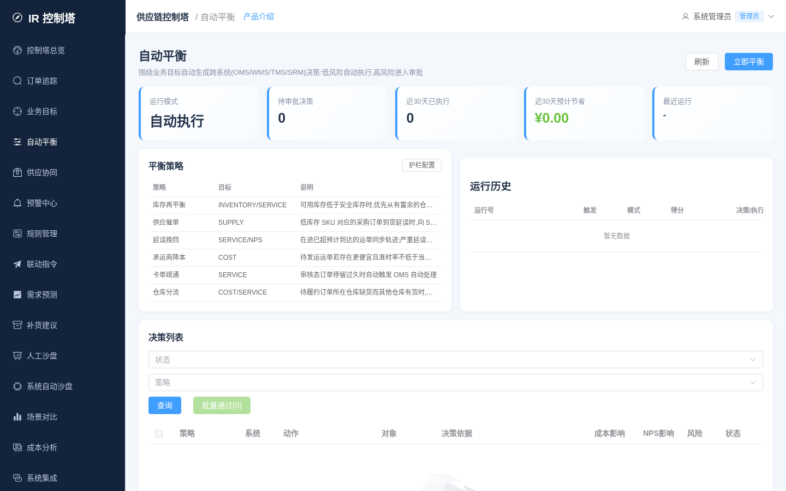

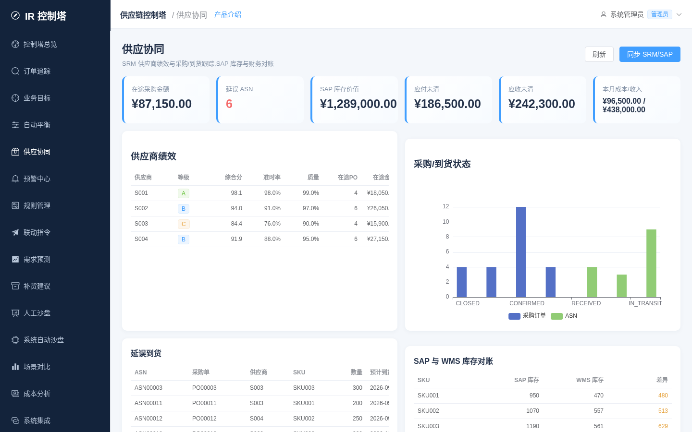

- 业务目标（成本 / 服务水平 / 库存周转）由管理员设定，页面实时显示达成偏差。
- 自动平衡三档：关闭 / 只建议 / 仅自动执行低风险决策；服务水平跌破阈值后自动停止降本动作。
- 供应协同：SRM 采购单、ASN、SAP 未清项与在途统一展示，缺口直接生成催单 / PR。

### 4.7 成本分析 —— 与 BMS 同一口径

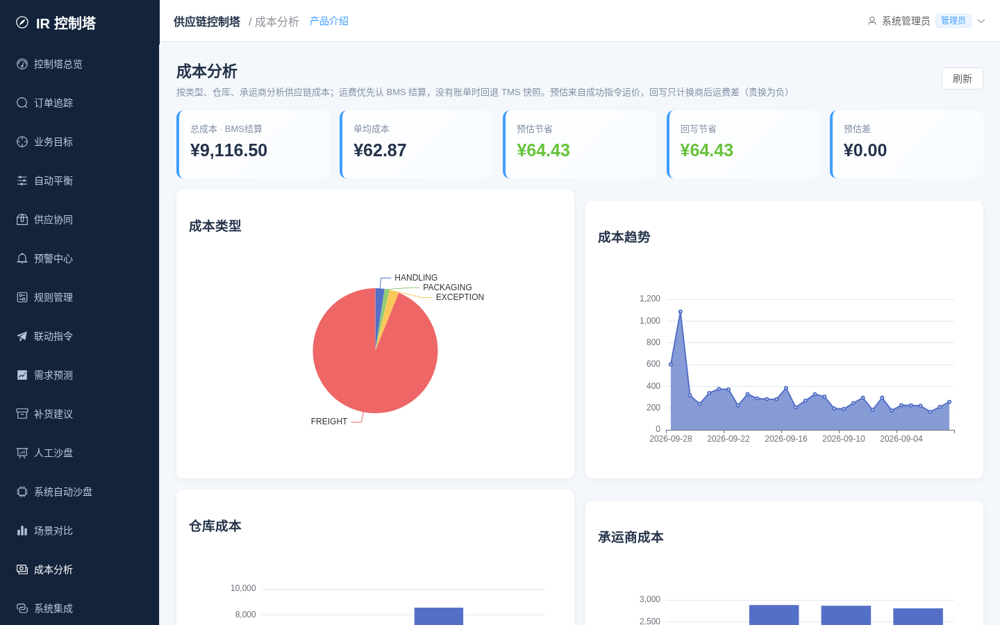

按仓 / 承运商 / 成本类型拆分 30 日成本；已进入结算的运费优先用结算数，未结算部分用估算并标注。

### 4.8 系统集成与权限 —— 可运维

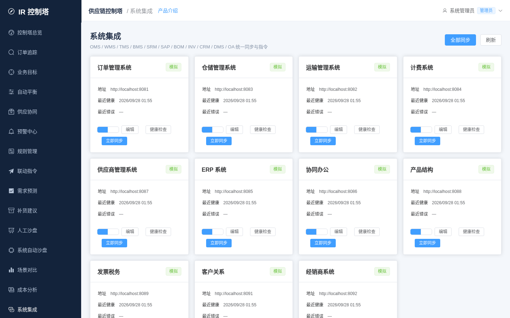

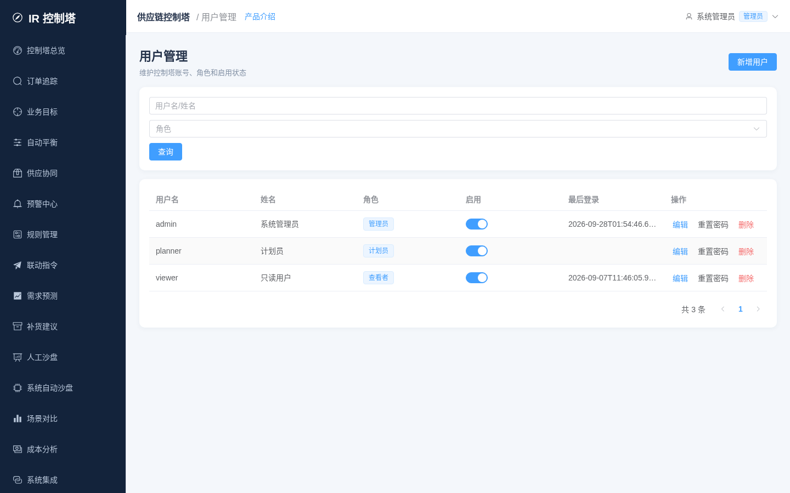

- 每套系统独立配置地址 / 模式 / 凭据，健康检查与同步日志可视。
- 三种角色：管理员（配置与目标）、计划员（预警 / 沙盘 / 指令）、查看者（只读）；操作日志全量留痕。

---

## 5. 一天怎么用

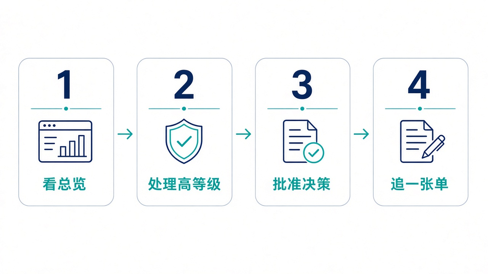

```mermaid
flowchart LR
    A[08:30 看总览<br/>目标偏差 + 待处理] --> B[09:00 处理预警<br/>批量执行指令]
    B --> C[10:00 看补货建议<br/>生成采购 / 补货]
    C --> D[下午 沙盘推演<br/>大促 / 换承运商 / 分仓]
    D --> E[17:00 对比场景<br/>把方案转为明日指令]
    E --> F[月末 成本复盘<br/>节约 vs 实账]
```

---

## 6. 技术方案

| 层 | 选型 | 说明 |
| --- | --- | --- |
| 后端 | Java 17 · Spring Boot 2.7 · MyBatis-Plus · H2(文件库) | 与 OTWB 同构，零外部依赖即可单机运行 |
| 前端 | Vue 3 · Vite · Element Plus · ECharts | 19 个页面，路由级权限守卫 |
| 集成 | Apache HttpClient · 适配器模式 | MOCK / HTTP 可切换；3s 连接超时；DNS 固定；禁重定向 |
| 安全 | PBKDF2 口令、Bearer Token、角色拦截器、出站地址校验、操作日志 | 生产要求 `IR_ALLOW_PRIVATE_HOSTS=false` 并修改默认密码 |
| 交付 | GitHub Actions：CI（测试 / Lint / 构建）+ Release（四平台原生包） | Docker 多阶段构建，`docker compose up -d` 一键启动 |

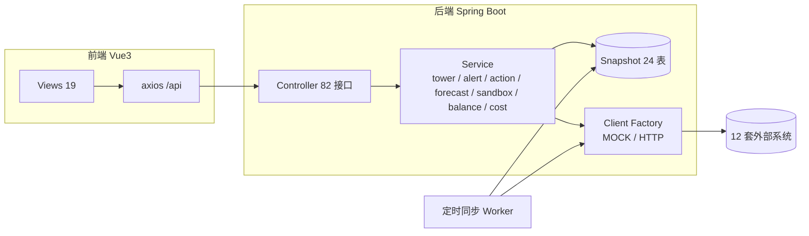
```mermaid
flowchart LR
    subgraph FE[前端 Vue3]
        V[Views 19] --> API[axios /api]
    end
    subgraph BE[后端 Spring Boot]
        CTRL[Controller 82 接口] --> SVC[Service<br/>tower / alert / action / forecast / sandbox / balance / cost]
        SVC --> SNAP[(Snapshot 24 表)]
        SVC --> CLI[Client Factory<br/>MOCK / HTTP]
    end
    API --> CTRL
    CLI --> EXT[(12 套外部系统)]
    SYNC[定时同步 Worker] --> SNAP
    SYNC --> CLI
```

---

## 7. 质量与工程治理

| 项 | 现状 |
| --- | --- |
| 自动化测试 | 后端 173 个（单元 + Spring 集成 + HTTP 契约），前端 Vitest；CI 每次 PR 必跑 |
| 代码规范 | Java 17 编译级别、ESLint + Prettier、EditorConfig |
| 覆盖率 | JaCoCo 报告随 `mvn verify` 生成 |
| 冒烟 / 巡检 | `scripts/smoke.sh` 覆盖 50+ 接口调用；`npm run ui-check` 巡检 19 个路由 |
| 端到端 | 浏览器录屏测试覆盖登录 / 角色 / 预测 / 沙盘 / 指令 / 集成校验等 13 个领域，发现 6 项问题已全部修复 |
| 代码评审 | 每个 PR 经自动化 Review，累计处理 40+ 条发现（事务边界、幂等、SSRF、数据一致性等） |
| 可观测 | `/actuator/health` 健康端点、按天滚动日志、操作日志 |

---

## 8. 里程碑

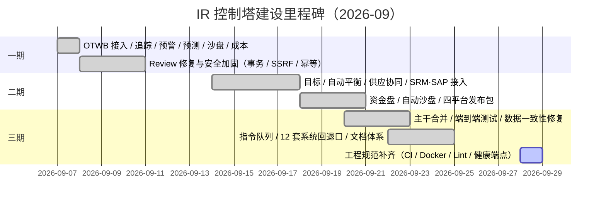
```mermaid
gantt
    title IR 控制塔建设里程碑（2026-09）
    dateFormat  YYYY-MM-DD
    section 一期
    OTWB 接入 / 追踪 / 预警 / 预测 / 沙盘 / 成本     :done, a1, 2026-09-07, 1d
    Review 修复与安全加固（事务 / SSRF / 幂等）        :done, a2, 2026-09-08, 3d
    section 二期
    目标 / 自动平衡 / 供应协同 / SRM·SAP 接入          :done, b1, 2026-09-14, 4d
    资金盘 / 自动沙盘 / 四平台发布包                   :done, b2, 2026-09-18, 3d
    section 三期
    主干合并 / 端到端测试 / 数据一致性修复             :done, c1, 2026-09-20, 3d
    指令队列 / 12 套系统回退口 / 文档体系              :done, c2, 2026-09-22, 3d
    工程规范补齐（CI / Docker / Lint / 健康端点）      :active, c3, 2026-09-28, 1d
```

---

## 9. 下一步计划

| 优先级 | 事项 | 价值 |
| --- | --- | --- |
| P0 | 与真实 OTWB 环境联调 HTTP 模式（先 OMS/WMS/TMS，再 BMS 成本口） | 从 MOCK 数据切到真实业务数据 |
| P0 | 生产部署：外置数据库（MySQL）、`IR_ALLOW_PRIVATE_HOSTS=false`、修改默认口令、日志接入集中平台 | 上线前置条件 |
| P1 | 与 SRM 核对多行采购单契约（`lines[].receivedQty`），完善在途口径 | 补货建议准确性 |
| P1 | 预测模型引入促销 / 节假日因子，接入渠道活动日历 | 大促场景预测精度 |
| P1 | 沙盘增加运力约束与仓容约束 | 推演结果更贴近可执行 |
| P2 | 数据库版本化迁移（Flyway）、指标埋点与告警（Prometheus） | 长期可维护性 |
| P2 | 移动端 / 大屏模式 | 管理层随时看 |

---

## 10. 风险与应对

| 风险 | 影响 | 应对 |
| --- | --- | --- |
| 外部系统接口契约与 MOCK 不一致 | 同步失败或数据口径偏差 | 已有 HTTP 契约测试与同步日志；联调阶段逐系统开启 |
| 自动执行误操作 | 影响真实业务单据 | 自动平衡默认"只建议"，低风险白名单 + 服务水平护栏 + 幂等键 + 全量操作日志 |
| 单机 H2 容量与可靠性 | 大数据量下性能与备份 | 已预留 MySQL 兼容模式，下一步外置数据库 |
| 成本数据滞后（BMS 事后结算） | 决策时成本为估算 | 页面区分"估算 / 实账"，结算数到达后优先采用 |
